# Guide — Création d’installateur d’application pour un projet WPF avec Visual Studio

Un installateur est un programme qui sert à installer un logiciel sur un ordinateur ou un autre dispositif électronique.

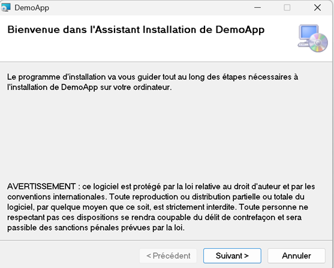<br>
Il existe plusieurs outils permettant de créer des installateurs pour des projet WPF avec Visual Studio comme `Microsoft Visual Studio Installer Projects`, `Inno Setup`, `MSIX Packaging Tool`, `Wix Toolset`, etc. 

Nous utiliserons la première solution (`Visual Studio Installer Projects`) car c’est une extension officielle de Microsoft, elle est gratuite, simple à utiliser et suffit à nos besoins. Petite critique : l’extension n’est pas parfaitement traduite en français, vous allez devoir être parfaitement bilingue pour l’utiliser !

Dans ce qui suit, vous serez guidés dans la création d’un Setup Project classique utilisant l’extension en question. Celle-ci crée par défaut 2 installateurs de type `.msi` et `.exe`.
Les étapes de 1 à 7 se concentrent sur la création d’un installeur pour un projet sans base de données.

## 1 - Ajout de l’extension
Commencez par ajouter l’extension **Microsoft Visual Studio Installer Projects 2022** à votre Visual Studio. La version 3.0.0 est compatible avec Visual Studio 2026.

Depuis Visual Studio, sélectionnez `Extensions / Gérer les extensions`, puis recherchez `Visual Studio Installer Projects 2022`. 
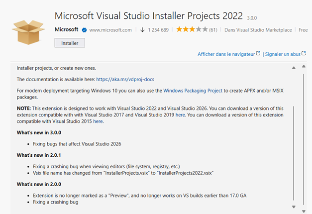

## 2 – Création du projet d’installation
L’installateur se présente sous forme d’un projet que vous allez ajouter à l'intérieur de votre solution. Clic droit sur la solution pour ajouter un nouveau projet de type `Setup Project`.
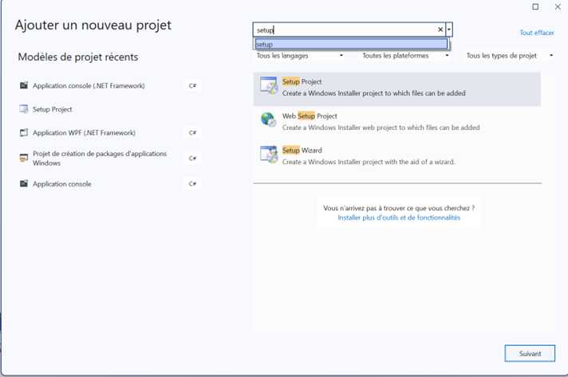<br>
Comme pour un projet ordinaire, donnez-lui un nom (Ex. NomDeVotreProjet**Installateur**) et spécifiez son emplacement. De préférence, choisir le même emplacement où se situe votre projet.

## 3 – Référencement du projet
Vous devez ensuite indiquer au projet installateur quel projet est concerné par l’installation en supposant que la solution peut contenir plusieurs projets : clic droit sur le `projet installateur / Add / Sortie de projet`.<br>
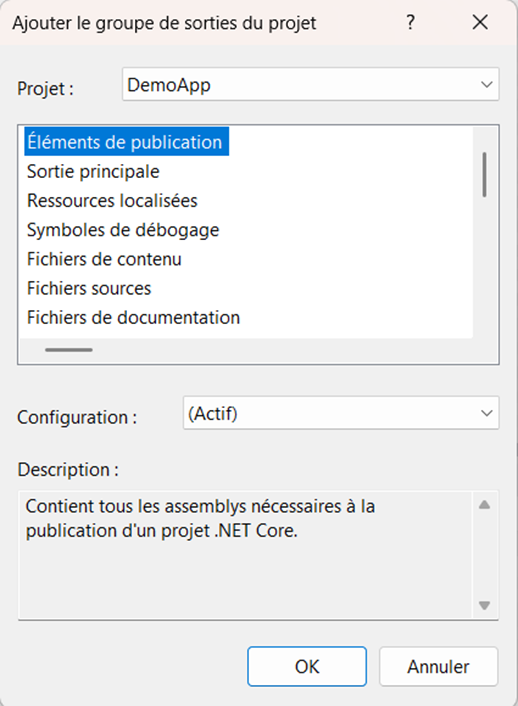<br>
Dans Projet, choisir le projet concerné par l’installation et sélectionnez ensuite `Éléments de publication`.
Il est aussi recommandé de renseigner quelques propriétés du projet tel que : `Author`, `Manufacturer` ou encore `Product Name`.<br>
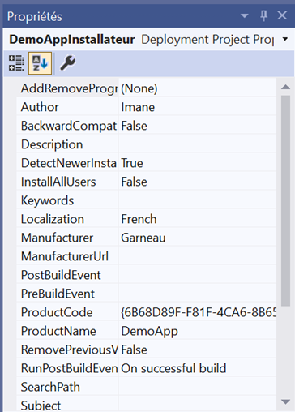<br>
::: tip Remarque : il n’est pas nécessaire d’ajouter manuellement les références de votre projet, celles-ci seront ajoutées automatiquement avec le projet.
:::

## 4 – Ajout de l’icône
L’ajout d’une icône à votre projet est fortement recommandé. Celle-ci sera visible par exemple sur le bureau ou bien sur le menu Démarrer de Windows pour représenter votre application une fois installée.
Vous pouvez télécharger (gratuitement : https://icon-icons.com/ , https://www.iconarchive.com/ , https://www.flaticon.com/ ) une icône pour votre projet ou bien en créer une en utilisant une application comme : Syncfusion Metro Studio 5, gratuit contre une inscription.
Pour gérer votre projet installateur, il faut passer par la vue `Système de fichiers` :
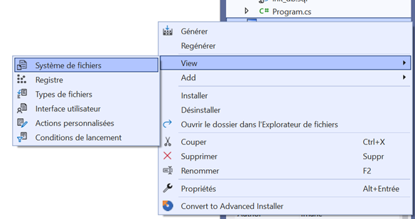<br>
À partir de `Application folder`, ajouter un fichier pour aller chercher l’icône que vous avez préalablement créée / téléchargée sur votre disque.
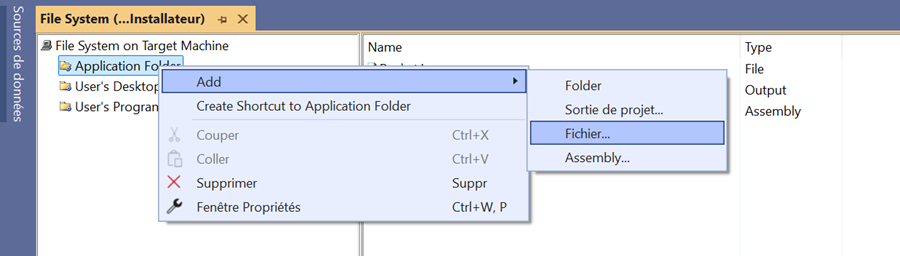<br>
Celle-ci apparaîtra ensuite dans le dossier d’application.
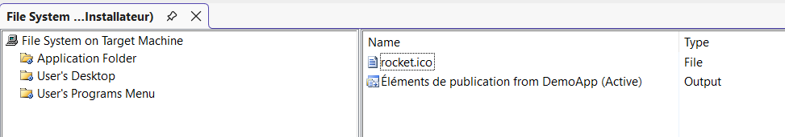

## 5 – Création des raccourcis
**Raccourci de bureau** : Sélectionnez `User’s Desktop`, clic droit sur le contenu (qui est pour le moment vide) et choisissez `Créer un raccourci`. 
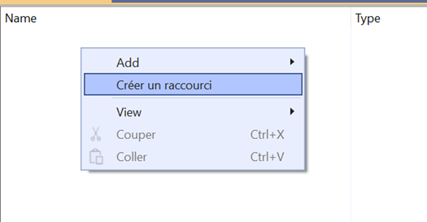
Double-clic sur `Application Folder` et choisir `Éléments de publication from … `. Il est très important de créer un raccourci vers la sortie principale qui représente tout simplement l’exécutable de votre application.
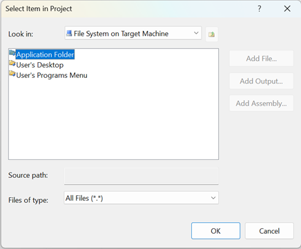 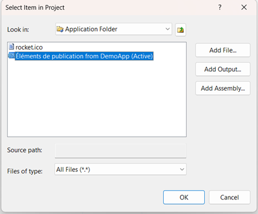
Pensez à renommer le raccourci:
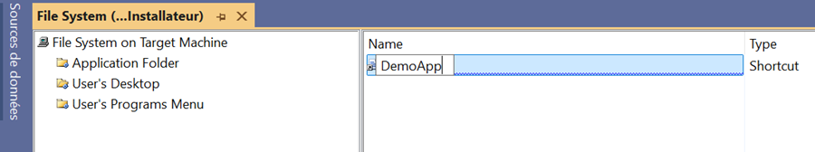
Dans les propriétés du raccourci, renseignez l’icône afin d’ajouter l’icône préalablement ajoutée à votre projet d’installation.
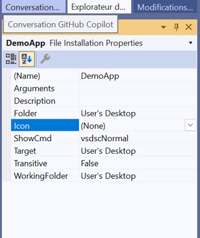 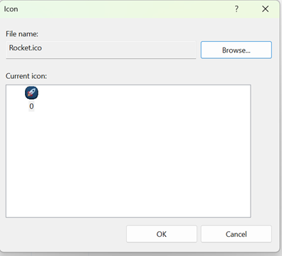
Enfin, dans les propriétés de `User’s Desktop`, mettre la valeur de `Always create` à `True`.
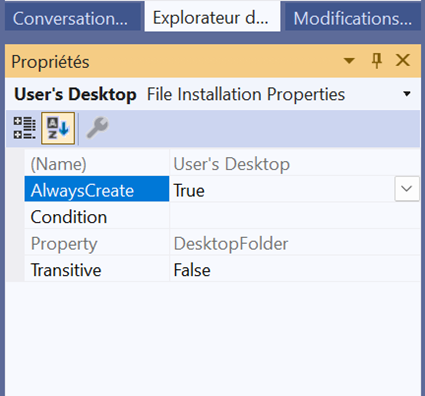
Pour le **Raccourci du menu Démarrer**, refaire le procédé précédent avec `User’s Programs Menu` à partir du système de fichiers.

## 6 – Générer l’installateur
La dernière étape de création d’un installateur pour un projet sans base de données consiste à générer l’installateur. 
Avant tout, assurez-vous que l'option **Release** (au lieu de Debug) est sélectionnée dans la barre d’outils de Visual Studio:

Clic droit sur le projet installateur et choisir Regénérer. 
Si la génération réussit :
1- Dans la console de sortie, vous ne devez pas avoir d’erreurs.
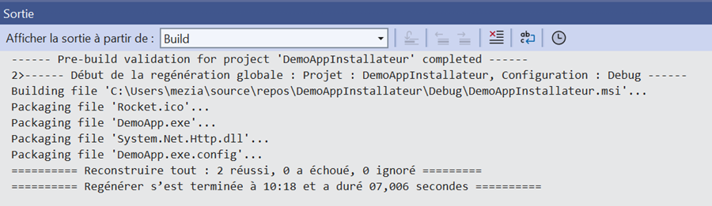
2- Deux fichiers exécutables (`.msi` et `.exe`) seront créés dans le dossier `Release` de votre projet d’installateur.
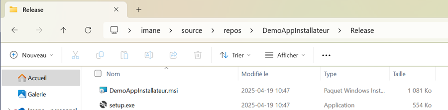

## 7 – Tester l’installation
Double-clic sur l’un des deux fichiers d’installation que vous venez de créer et suivez les étapes d’installation. 
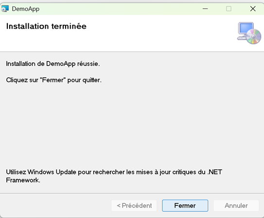
Une fois celle-ci terminée, vous verrez apparaître deux raccourcis : l’un sur le Bureau et le deuxième accessible à partir du menu Démarrer.
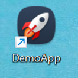 

## 8 – Projet avec une Base de données 
Si vous avez une application qui persiste des données dans une base de données SQLite, celle-ci devrait être initialisée après l’installation de l’application.
Il existe deux approches :
-	L’installateur crée lui-même le fichier de base de données après l’installation de l’application et exécute un script qui crée la structure de la base (tables, contraintes, données initiales, etc.)
-	Au premier lancement de l’application, celle-ci crée la base et exécute le script.

Dans un souci de simplification, c’est la deuxième approche que je vous recommande pour ce cours.
Pour cela, votre application doit implémenter le code contenant les requêtes SQL permettant de définir la structure de la base. 
Exemple : 
```csharp
public static void InitialiserBD()
{
    using (var connexion = new SqliteConnection(GetChaineDeConnexion()))
    {
        connexion.Open();

        string reqCreateUtilisateur = @"
        CREATE TABLE IF NOT EXISTS Utilisateurs (
            id INTEGER PRIMARY KEY AUTOINCREMENT,
            nom TEXT NOT NULL,
            courriel TEXT UNIQUE
        );";

        using (var command = new SqliteCommand(reqCreateUtilisateur, connexion))
        {
            command.ExecuteNonQuery();
        }
    }
}
```

::: warning Attention
Les requêtes de création des tables doivent obligatoirement contenir la clause `IF NOT EXISTS` afin d’éviter que les tables ne soient réinitialisées à chaque lancement de l’application.
:::

### 8.1 Où stocker la base de données ?
Lors du processus d’installation, l’utilisateur a la possibilité de choisir l’emplacement où il voudrait installer l’application. Si l’utilisateur décide d’installer l’application dans le dossier `Program Files`, comme il est commun de faire, l’application ne pourra pas créer la base de données à cet emplacement sans demander les droits administrateurs.

Afin de simplifier cette étape, vous allez faire en sorte que la base de données soit par défaut enregistrée dans le dossier `ProgramData` qui ne nécessite pas de droits admin. Ce dossier se trouve dans le `Disque local C` et est souvent utilisé pour stocker les données des applications. (Ce dossier est par défaut caché, pour y accéder vous devez afficher les dossiers cachés à partir de l’Explorateur Windows).

Voici un bout de code que vous pouvez réutiliser pour la création du dossier dans ProgramData portant le nom de votre application. La fonction crée la BD si celle-ci n’existe pas et retourne le chemin menant vers elle.
```csharp
private const string NomApp = "DemoApp";
private const string FichierBD = "mabase.db";

public static string GetChaineDeConnexion()
{

    // Chemin ex.: C:\ProgramData\DemoApp\data.db
    string CheminProgramData = Environment.GetFolderPath(Environment.SpecialFolder.CommonApplicationData);
    string CheminDuDossier = Path.Combine(CheminProgramData, NomApp);
    string CheminDeBD = Path.Combine(CheminDuDossier, FichierBD);

    if (!Directory.Exists(CheminDuDossier))
        Directory.CreateDirectory(CheminDuDossier);

    // Si la BD n'existe pas, elle sera créée
    return $"Data Source={CheminDeBD}";
}
```
Finalement:
- Pensez à regénérer le projet d’installation en mode Release afin de créer l’installateur comme dans l’étape 6.
- Testez l’installation et vérifiez que votre base de données a bel et bien été créée dans le dossier `C:\ProgramData\DemoApp\`.