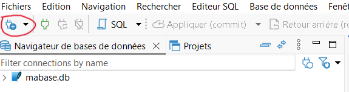
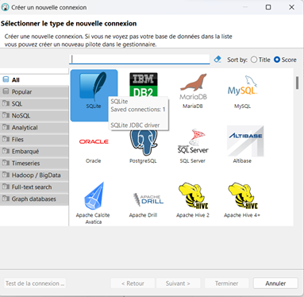
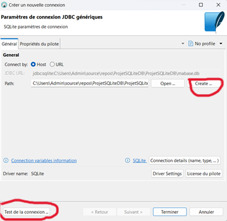
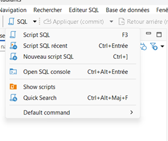
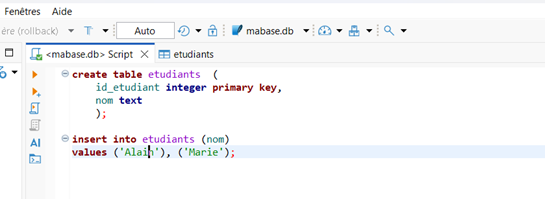
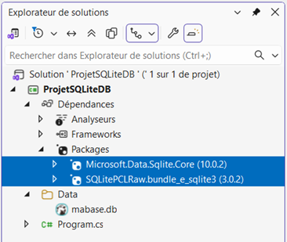

# Base de données embarquée - SQLite

`SQLite` est un système de gestion de base de données léger. Contrairement aux SGBD classiques tels que `MySQL` ou `Oracle`, il n'a pas besoin d'un serveur pour fonctionner. À la place d'une base de données hébergée sur un serveur, une base de données embarquée se présente sous forme d'un seul fichier. 

## Avantages
- Facilité de déploiement car aucune administration : une simple manipulation d'un fichier.
- Multiplateforme
- Très populaire : la plus utilisée dans le monde (smartphones, navigateurs ...)
- Un choix idéal pour le stockage de données locales
## Inconvénient
Ne convient pas dans le cas d'une très forte sollicitation de la base. Exemple : un site Web avec un grand trafic et plusieurs écritures simultanées. 
## Client SQL à recommander : DBeaver
**[DBeaver](https://dbeaver.io/download/)**  est un client SQL graphique et universel. Community en est la version gratuite.
Voici comment créer une base de données SQLite avec DBeaver :
1. Créer une nouvelle connexion :
<br>
<br>
2. Spécifier le chemin vers son emplacement physique sur le disque puis tester la connexion.
<br>
La base de données est un fichier avec l'extension **.db**. Vous pouvez le créer en lui donnant un nom. Exemple : `mabase.db`.
3. Pour exécuter des requêtes `SQL` (insert, update, select ...)
 <br>


## Connexion à partir d'un projet C#
Pour se connecter à une BD `SQLite`, il existe plusieurs packages `NuGet` mais je vous recommande d'utiliser le package officiel de Microsoft pour sa légèreté et sa popularité.
1. Vous aurez besoin d'ajouter les 2 packages suivants à votre projet :
- [Microsoft.Data.Sqlite](https://www.nuget.org/packages/Microsoft.Data.Sqlite.Core)
- [SQLitePCLRaw.bundle_e_sqlite3](https://www.nuget.org/packages/sqlitepclraw.bundle_e_sqlite3/)
<br>
2. L'utilisation de la librairie est très semblable à celle que vous avez utilisée en cours de Programmation Orientée Objet(`MySQL Connector`) pour vous connecter et interagir avec une base de données `MySQL`. La seule différence réside dans l'importation du package et la définition de la chaîne de connexion.
- Importation de la librairie :
```c#
using Microsoft.Data.Sqlite;
```
- Dans la chaîne de connexion, il suffit de spécifier le chemin physique du fichier de base de données (contrairement à MySQL où il faut spécifier les paramètres de connexion au serveur):
```c#
string chaineDeConnexion = @"Data Source=C:\...\ProjetSQLiteDB\Data\mabase.db;";
```
*Conseil : Pour un code propre, il est recommandé de placer le fichier de base de données (.db) à l'intérieur d'un dossier Data se trouvant à la racine du projet.*
- Le reste des instructions (création de la connexion, préparation d'une commande SQL, l'exécuter ...) devraient être identiques à celles de `MySQL Connector`. Au besoin, veuillez consulter la documentation officielle de **[Microsoft Data SQLite](https://learn.microsoft.com/en-us/dotnet/standard/data/sqlite/)**.
